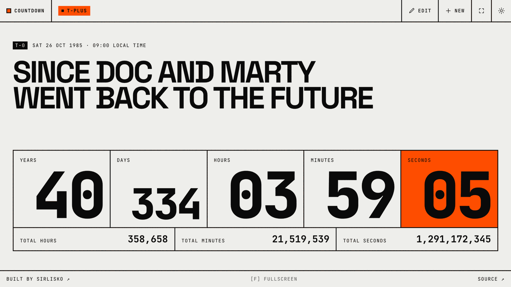

# Countdown [![Test Status][test-image]][test-url] [![Build Status][build-image]][build-url]

Create a countdown (or count-up) to any moment and share it as a link. The whole countdown lives in the URL, so there's no account and nothing stored on a server.

<picture>
  <source media="(prefers-color-scheme: dark)" srcset="docs/screenshot-dark.png">
  
</picture>

[See it live](https://countdown.sirlisko.com/?f=h%2Cm%2Cs&m=since%20Doc%20and%20Marty%20went%20Back%20to%20the%20Future&t=1985-10-26T09%3A00%3A00.000Z)

## Features

- Counts down to future dates and up from past ones
- Choose which units to show: hours, minutes, seconds
- Yearly countdowns that roll over to the next occurrence
- Optional progress bar measured from when the countdown was created
- Fire at a fixed moment for everyone, or at the same local time for each viewer
- Obfuscated links that hide the message and date from the URL
- Add the event to Google Calendar or download it as `.ics`
- Link previews (Open Graph images) rendered on the edge
- Fullscreen mode (`F`) and light/dark theme

## Install dependencies

> this project is using [pnpm](https://pnpm.io/) as package manager but it should work with npm as well

```bash
pnpm install
```

## Run it locally

```bash
pnpm start
```

## Run the tests

```bash
pnpm test        # unit and component tests, in watch mode
pnpm test:e2e    # builds the app and drives it in Chromium
```

The first e2e run needs a browser: `pnpm exec playwright install chromium`.

## The stack

- WebApp scaffolded via [Vite](https://vitejs.dev/)
- Typecheck and superset of JS by [Typescript](https://www.typescriptlang.org/)
- Check the syntax and formatting of the JS, via [Biome](https://biomejs.dev/)
- Unit and component tests with [Vitest](https://vitest.dev/) and [Testing Library](https://testing-library.com/), end-to-end tests with [Playwright](https://playwright.dev/)
- CI using [Github Actions](https://github.com/features/actions)
- Styling [Tailwind CSS](https://tailwindcss.com/)
- UI Components [Shadcn/ui](https://ui.shadcn.com)
- Hosted on [Netlify](https://netlify.com), with Edge Functions rendering link-preview (Open Graph) images

It's possible to [check out the v1 of the project](https://github.com/sirLisko/countdown/tree/v0.1), running Create React App, Jest, Emotion and Babel Macros.

[test-image]: https://github.com/sirlisko/countdown/workflows/Test%20CI/badge.svg
[test-url]: https://github.com/sirLisko/countdown/actions
[build-image]: https://api.netlify.com/api/v1/badges/fbe6d19d-38dd-4cac-ba31-a39bc9fa5a07/deploy-status
[build-url]: https://app.netlify.com/sites/fancy-countdown/deploys
